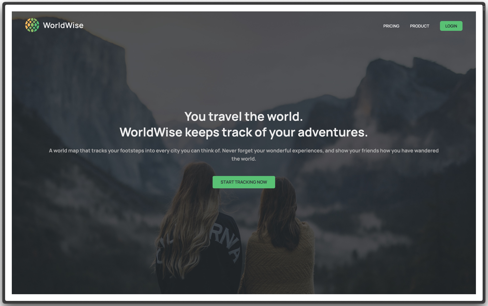
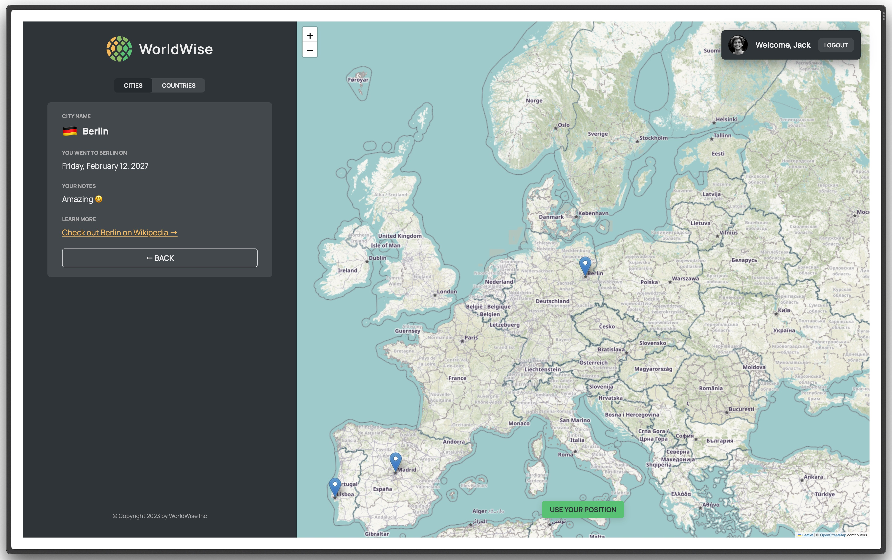

# WorldWise Web App

Simple web app that allows users to keep track of the places they've visited. Built to highlight routing, the react context API as well as the leaflet library.

Project based on [The Ultimate React Course 2023](https://www.udemy.com/course/the-ultimate-react-course/) by Jonas Schmedtmann.

## Getting Started

Run `npm install` or `bun install` to install all needed dependencies.

```bash
$ npm install
```

The API is simulated by a JSON file in the data folder running on `json-server`. The `--delay` flag is set to 500 milliseconds to simulate latency so the loading components have time to render. This can be changed inside `package.json`.

```bash
$ npm run server

# on another terminal instance
$ npm run dev
```

## Screenshots

Home page



Application


